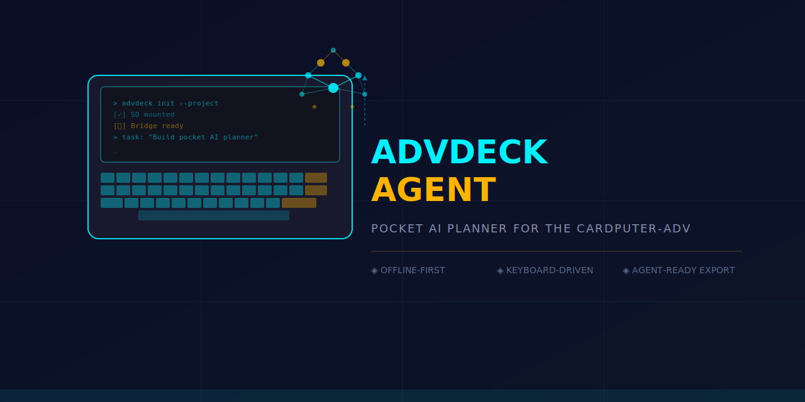
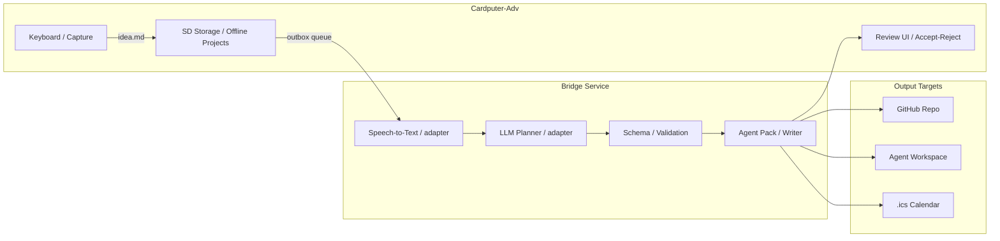

<picture>
  <source media="(prefers-color-scheme: dark)" srcset="assets/logo.svg">
  <source media="(prefers-color-scheme: light)" srcset="assets/logo.svg">
  
</picture>

<p align="center">
  <a href="https://github.com/NaustudentX18/m5-cardputer-adv/blob/main/LICENSE"></a>
  <a href="#"></a>
  <a href="#"></a>
  <a href="https://github.com/NaustudentX18/m5-cardputer-adv/blob/main/ROADMAP.md"></a>
  <a href="https://github.com/NaustudentX18/m5-cardputer-adv/stargazers"></a>
</p>

<p align="center">
  <b>Capture messy ideas offline. Get back clean project plans.</b><br>
  <i>Notion AI for builders</i> — in your pocket. Keyboard-first. Agent-ready export.
</p>

<p align="center">
  <a href="#-quick-start"><b>Quick Start</b></a> · <a href="#-roadmap"><b>Roadmap</b></a> · <a href="docs/ARCHITECTURE.md"><b>Architecture</b></a> · <a href="AGENTS.md"><b>For Agents</b></a> · <a href="docs/AGENT_HANDOFF.md"><b>Handoff</b></a>
</p>

---

## ✦ What Is This?

You're away from your desk. An idea hits. You type it — rough, messy, incomplete — on the **M5Stack Cardputer-Adv**. That's it. No Wi-Fi needed, no cloud account, no API keys.

Later, when you're back at your network, the **bridge service** does the heavy lifting: turns your rambling idea into a structured project brief, roadmap, task list, and a self-contained **agent handoff pack** that any coding agent can execute without guessing.



---

## ✦ What It Produces

From one messy text file, you get a complete project drop:

```text
project-slug/
├── idea.md                   ← your original raw input (never deleted)
├── brief.md                  ← structured project brief
├── plan.md                   ← phased implementation plan
├── tasks.json                ← machine-readable task list
├── calendar-suggestions.json
├── agent-prompt.md           ← self-contained handoff for any coding agent
└── export/
    ├── agent-pack.md         ← the single file an agent needs
    └── agent-tasks.json
```

---

## ✦ Roadmap

**Current progress:** `██████████░░░░░░░░░░` **80%** complete · **Phase 3 of 5**

<table>
  <thead>
    <tr>
      <th width="80">Phase</th>
      <th>Deliverable</th>
      <th width="110">Status</th>
      <th width="120">Progress</th>
    </tr>
  </thead>
  <tbody>
    <tr>
      <td><b>α 0.1</b></td>
      <td><b>Text-to-plan loop</b> — firmware skeleton, SD storage, idea capture, fixture import, review UI, agent pack export</td>
      <td></td>
      <td><code>██████████</code> 100%</td>
    </tr>
    <tr>
      <td><b>α 0.2</b></td>
      <td><b>Real planner bridge</b> — local dry-run provider → first live LLM adapter, schema validation, artifact writer</td>
      <td></td>
      <td><code>██████</code> 60%</td>
    </tr>
    <tr>
      <td><b>α 0.3</b></td>
      <td><b>Calendar intelligence</b> — AI-generated schedule suggestions, accept/reject flow, <code>.ics</code> export, reminders</td>
      <td></td>
      <td><code>████████</code> 80%</td>
    </tr>
    <tr>
      <td><b>α 0.4</b></td>
      <td><b>Voice capture</b> — ES8311 recording, WAV→SD, transcription bridge, transcript→plan pipeline</td>
      <td></td>
      <td><code>░░░░░░░░░░</code> 0%</td>
    </tr>
    <tr>
      <td><b>β 0.5</b></td>
      <td><b>Agent workflow polish</b> — stronger task schema, dependency ordering, role suggestions, workspace export</td>
      <td></td>
      <td><code>░░░░░░░░░░</code> 0%</td>
    </tr>
  </tbody>
</table>

### ✦ Later / Out of MVP

```
BLE HID snippet export   ·   WebUI over SoftAP   ·   local workspace watcher
companion C5 status panel   ·   LoRa/GPS project metadata
optional issue tracker integrations   ·   optional secure sync
```

> **Full detail** → [ROADMAP.md](ROADMAP.md) · **Task queue** → [roadmap/advdeck-agent-swarm-tasks.md](roadmap/advdeck-agent-swarm-tasks.md) · **PRD** → [roadmap/advdeck-agent-prd.md](roadmap/advdeck-agent-prd.md)

---

## ✦ Quick Start

```bash
# Clone
git clone https://github.com/NaustudentX18/m5-cardputer-adv.git
cd m5-cardputer-adv

# Firmware (requires PlatformIO + ESP32 support)
cd projects/advdeck-agent
pio run -e cardputer-adv

# Bridge (dry-run mode — no credentials needed)
cd ../../bridge/advdeck-agent-bridge
# TBD once implementation starts
```

| Path | Start with |
|:---|:---|
| **Human contributor** | [docs/PRODUCT.md](docs/PRODUCT.md) → [docs/ARCHITECTURE.md](docs/ARCHITECTURE.md) → [ROADMAP.md](ROADMAP.md) |
| **Coding agent** | [AGENTS.md](AGENTS.md) → [docs/AGENT_HANDOFF.md](docs/AGENT_HANDOFF.md) → [swarm tasks](roadmap/advdeck-agent-swarm-tasks.md) |

---

## ✦ Design Principles

<table>
  <thead>
    <tr><th width="180">Principle</th><th>What it means</th></tr>
  </thead>
  <tbody>
    <tr>
      <td><b>Offline-first</b></td>
      <td>Boots and works fully without Wi-Fi, cloud, or API keys</td>
    </tr>
    <tr>
      <td><b>Keyboard-native</b></td>
      <td>Every action has a keyboard mnemonic — not a touch-first UX forced onto tiny screens</td>
    </tr>
    <tr>
      <td><b>Plain files</b></td>
      <td>Projects are folders of Markdown and JSON on SD card. No proprietary format lock-in</td>
    </tr>
    <tr>
      <td><b>Review gate</b></td>
      <td>AI output is never auto-applied. You review before it touches your project</td>
    </tr>
    <tr>
      <td><b>Agent-ready</b></td>
      <td>Export is a self-contained pack. A fresh coding agent opens one file and starts working — no hidden context</td>
    </tr>
  </tbody>
</table>

---

## ✦ Hardware

Targets **M5Stack Cardputer-Adv** (SKU `K132-Adv`):

| Subsystem | Detail |
|:---|:---|
| **MCU** | ESP32-S3 (Stamp-S3A) |
| **Display** | 240×135 ST7789 |
| **Keyboard** | TCA8418 matrix expander |
| **Storage** | microSD |
| **Audio** | ES8311 codec + speaker / mic / headphone |
| **Sensors** | BMI270 IMU |
| **Expansion** | Grove + EXT ports |

Detailed hardware notes → [research/hardware/cardputer-adv-hardware.md](research/hardware/cardputer-adv-hardware.md)

---

## ✦ Repository

```text
.
├── .github/              CI, issue templates, PR template
├── bridge/               Off-device AI bridge service
├── docs/                 Product, architecture, development, ADRs
├── projects/             Firmware project launch point
├── research/             Hardware, software, market scan, sources
├── roadmap/              PRD, plan, and swarm task queue
├── tests/fixtures/       Shared test data
├── templates/            Reusable firmware templates
└── assets/               Art, icons, fonts, logo
```

---

## ✦ Safety

| Always | Never |
|:---|:---|
| Raw ideas & transcripts preserved forever | Cloud dependency at boot |
| AI output gated behind human review | API keys stored on-device |
| Calendar suggestions opt-in | Radio starts without explicit user action |
| Companion hardware stays optional | Powered-off reminder guarantees |

---

<p align="center">
  <sub>Built for builders. No cloud lock-in. No hidden context. Just a pocket and a keyboard.</sub>
</p>

<p align="center">
  <a href="https://github.com/NaustudentX18/m5-cardputer-adv/issues/new/choose"><b>★ Report a bug</b></a> · <a href="https://github.com/NaustudentX18/m5-cardputer-adv/issues/new/choose"><b>★ Request a feature</b></a> · <a href="AGENTS.md"><b>★ Contribute as an agent</b></a>
</p>
