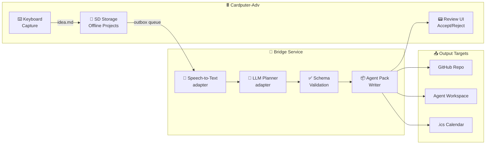

<picture>
  <source media="(prefers-color-scheme: dark)" srcset="assets/logo.svg">
  <source media="(prefers-color-scheme: light)" srcset="assets/logo.svg">
  
</picture>

<p align="center">
  <a href="https://github.com/NaustudentX18/m5-cardputer-adv/blob/main/LICENSE"></a>
  <a href="#"></a>
  <a href="#"></a>
  <a href="https://github.com/NaustudentX18/m5-cardputer-adv/blob/main/ROADMAP.md"></a>
</p>

<p align="center">
  <b>Capture messy ideas offline. Get back clean project plans.</b><br>
  Think <i>Notion AI for builders</i> — in your pocket. Keyboard-first. Agent-ready export.
</p>

---

## What Is This?

You're away from your desk. An idea hits. You type it — rough, messy, incomplete — on the **M5Stack Cardputer-Adv**. That's it. No Wi-Fi needed, no cloud account, no API keys.

Later, when you're back at your network, the **bridge service** does the heavy lifting: turns your rambling idea into a structured project brief, roadmap, task list, and a self-contained **agent handoff pack** that any coding agent can execute without guessing.



---

## What It Produces

From one messy text file, you get:

```
project-slug/
├── idea.md              ← your original raw input (never deleted)
├── brief.md             ← structured project brief
├── plan.md              ← phased implementation plan
├── tasks.json           ← machine-readable task list
├── calendar-suggestions.json
├── agent-prompt.md      ← self-contained handoff for any coding agent
└── export/
    ├── agent-pack.md    ← the single file an agent needs
    └── agent-tasks.json
```

---

## Roadmap

| Phase | What | When |
|:---|:---|:---|
| **α 0.1** 🚧 | Text-to-plan loop. Firmware skeleton, SD storage, idea capture, fixture import, review UI, agent pack export. | Current |
| **α 0.2** | Real planner bridge. Local dry-run provider → first live LLM adapter, schema validation, artifact writer. | After 0.1 |
| **α 0.3** | Calendar intelligence. AI-generated schedule suggestions, accept/reject flow, `.ics` export, reminders. | After 0.2 |
| **α 0.4** | Voice capture. ES8311 recording, WAV→SD, transcription bridge, transcript→plan pipeline. | After 0.3 |
| **β 0.5** | Agent workflow polish. Stronger task schema, dependency ordering, role suggestions, workspace export. | After 0.4 |

Full detail → [ROADMAP.md](ROADMAP.md) · Task queue → [roadmap/advdeck-agent-swarm-tasks.md](roadmap/advdeck-agent-swarm-tasks.md)

---

## Quick Start

```bash
# Clone
git clone https://github.com/NaustudentX18/m5-cardputer-adv.git
cd m5-cardputer-adv

# Firmware (requires PlatformIO + ESP32 support)
cd projects/advdeck-agent
pio run -e cardputer-adv

# Bridge (dry-run mode — no credentials needed)
cd bridge/advdeck-agent-bridge
# TBD once implementation starts
```

**For humans:** start with [docs/PRODUCT.md](docs/PRODUCT.md) → [docs/ARCHITECTURE.md](docs/ARCHITECTURE.md) → [ROADMAP.md](ROADMAP.md)  
**For agents:** start with [AGENTS.md](AGENTS.md) → [docs/AGENT_HANDOFF.md](docs/AGENT_HANDOFF.md) → pick from [swarm tasks](roadmap/advdeck-agent-swarm-tasks.md)

---

## Design Principles

| Principle | What It Means |
|:---|:---|
| 🔌 **Offline-first** | Boots and works fully without Wi-Fi, cloud, or API keys |
| ⌨️ **Keyboard-native** | Every action has a keyboard mnemonic — not a touch-first UX forced onto tiny screens |
| 📂 **Plain files** | Projects are folders of Markdown and JSON on SD card. No proprietary format lock-in |
| 🛡️ **Review gate** | AI output is never auto-applied. You review before it touches your project |
| 🤖 **Agent-ready** | Export is a self-contained pack. A fresh coding agent opens one file and starts working — no hidden context |

---

## Hardware

Targets **M5Stack Cardputer-Adv** (SKU `K132-Adv`):

- **MCU:** ESP32-S3 (Stamp-S3A)
- **Display:** 240×135 ST7789
- **Keyboard:** TCA8418 matrix expander
- **Storage:** microSD
- **Audio:** ES8311 codec + speaker/mic/headphone
- **Sensors:** BMI270 IMU
- **Expansion:** Grove + EXT ports

Detailed hardware notes → [research/hardware/cardputer-adv-hardware.md](research/hardware/cardputer-adv-hardware.md)

---

## Repository

```
.
├── .github/              CI, issue templates, PR template
├── bridge/               Off-device AI bridge service
├── docs/                 Product, architecture, development, ADRs
├── projects/             Firmware project launch point
├── research/             Hardware, software, market scan, sources
├── roadmap/              PRD, plan, and swarm task queue
├── tests/fixtures/       Shared test data
├── templates/            Reusable firmware templates
└── assets/               Art, icons, fonts, logo
```

---

## Safety

- ❌ No cloud dependency at boot
- ❌ No API keys stored on-device
- ❌ No radio starts without explicit user action
- ✅ Raw ideas and transcripts preserved forever
- ✅ AI output gated behind review
- ✅ Calendar suggestions are suggestions until accepted
- ✅ Companion radio hardware is optional, not required

---

<p align="center">
  <sub>Built for builders. No cloud lock-in. No hidden context. Just a pocket and a keyboard.</sub>
</p>
